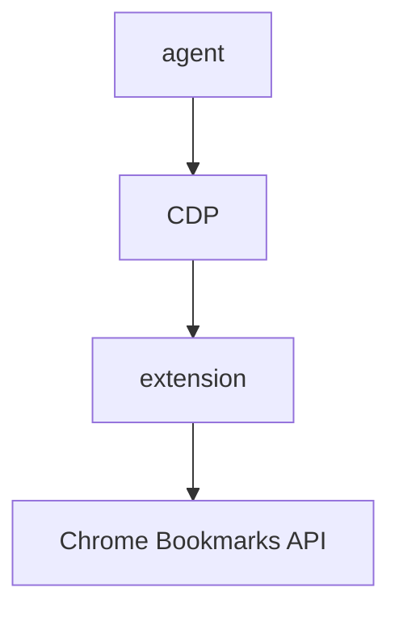
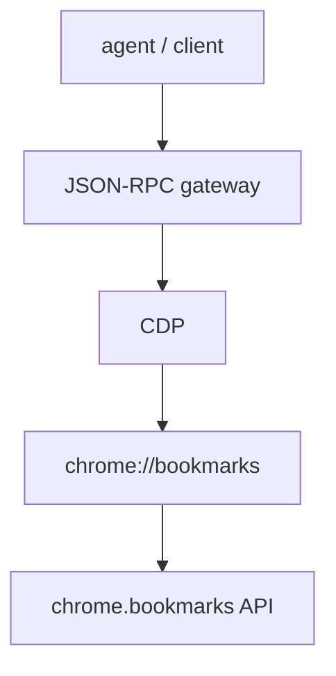

::external-link-card
---
url: https://github.com/pavel-voronin/chrome-bookmarks-gateway
title: pavel-voronin/chrome-bookmarks-gateway
icon: streamline-ultimate-color:github-logo-1
---
::

While building my personal agent, it became clear pretty quickly that it needed access to my browser bookmarks. I bookmark everything — from my phone, from desktop, often with zero organization. The agent was supposed to sort through all of it: search, categorize, find duplicates, pull context from saved links. And not just read — it needed to create bookmarks, move them, delete them, and receive change events.

This is where the rabbit hole began. Chrome has a solid `Bookmarks API`, but it's only available to extensions. Outside the browser, there's essentially no proper interface for working with bookmarks.

So the problem became: how do you give an external agent access to a `Bookmarks API` that lives inside the browser.

Below is a short log of how the solution gradually evolved from naive to working.

# First idea: read the bookmarks file

The most obvious idea was almost mundane: if Chrome stores bookmarks somewhere, just read the file.

And indeed — Chrome stores them as JSON. The structure is fairly straightforward, and for read-only scenarios it almost looks like the perfect solution. The file lives inside the profile directory at `~/Library/Application Support/Google/Chrome/Default/Bookmarks` (macOS).

But it quickly turned out that the file is not the source of truth.

Chrome freely overwrites it during its own operations or during sync. And crucially — you can't get change events from a file.

So you can read the file, but you can't build a reliable management interface on top of it.

This stage was useful because it immediately established something important: the real source of state is not the file — it's the live browser.

# Second attempt: use an extension

The next logical step was obvious after reading the docs: Chrome has a full-featured `Bookmarks API`, but it's only available to extensions.

So I built a proof of concept using an extension.

This gave me the first working architecture:



Since the agent runs outside the browser, accessing the extension code still went through Chrome DevTools Protocol (CDP).

This approach actually worked:

- you could read the bookmark tree
- you could create and delete bookmarks
- you could subscribe to events

But the architecture looked a bit odd. The extension carried no logic — it existed purely as a technical shim.

And the longer I stared at this setup, the more I wanted to know: could I get rid of the extension entirely.

# The key insight: it's not about the extension, it's about the context

The breakthrough came when I started working with CDP more closely.

Through CDP you can connect to the browser via WebSocket and execute code inside various browser contexts.

At some point it clicked: the extension has access to `chrome.bookmarks` not simply because it's an extension, but because it runs in a privileged browser context. `chrome.*` APIs are available in such contexts — extension pages, extension service workers, and certain internal `chrome://` pages.

The key word is "certain." Not every `chrome://` page exports every namespace. It depends on which APIs that particular WebUI needs. The `chrome://` pages themselves are full-fledged web applications built with HTML/JS, rendered by the browser engine but running in a privileged environment. And CDP can inject code into any of these contexts.

This means that if a specific `chrome://` page has access to the API you need, code executed via CDP in that page's context gets the same access. And `chrome://bookmarks/` does export `chrome.bookmarks`:

After this, the architecture simplified dramatically.

Before:

```
CDP → extension → bookmarks API
```

After:

```
CDP → chrome://bookmarks → bookmarks API
```

The extension turned out to be simply unnecessary.

In practice it works like this. Chrome launches with the `--remote-debugging-port` flag, after which CDP exposes a list of all targets at `http://localhost:9222/json`. Among them will be `chrome://bookmarks/`. Connect to its `webSocketDebuggerUrl` — and you can execute code in its context:

```javascript
// 1. Find the target
const targets = await fetch("http://localhost:9222/json").then((r) => r.json());
const bookmarks = targets.find((t) => t.url === "chrome://bookmarks/");

// 2. Connect via WebSocket
const ws = new WebSocket(bookmarks.webSocketDebuggerUrl);

// 3. Call Chrome API
await Runtime.evaluate({
  expression: "chrome.bookmarks.getTree()",
  awaitPromise: true,
  returnByValue: true,
});
```

At this point, the solution finally started looking like a proper engineering construct rather than a pile of hacks. And it became clear that bookmarks were just the first case — the same mechanism potentially opens access to other Chrome APIs, as long as the corresponding `chrome://` page exports them.

# The CLI phase and abandoning it

Originally the project was conceived as a CLI tool. It seemed logical that the interface for working with bookmarks would be the command line — good for automation, easy to plug into pipelines.

So a lot of effort went into the CLI: interactive installer, auto-updates, tab completion, various output formats. It was convenient for experimenting and running through real bookmark scenarios.

But at some point I realized I was building a polished interface for the wrong consumer. An agent is not a human in a terminal. It doesn't need tab completion. It doesn't need interactive mode. It needs a network call and a structured response.

When the architecture started shifting toward a Docker container with a browser inside, the CLI only created extra problems. For the agent to use it, I'd have to either build a separate gateway on top of the CLI or write a thin client that talks over the network. Both options looked like hacks on top of a hack.

Killing the CLI was unpleasant — a lot of work had gone into it, and it actually worked. But this is one of those cases where the tool served its purpose — it helped debug the core and validate scenarios — and then started holding back progress. I kept it as legacy and went to build the service.

# Moving to a service

The next step was turning the system into a proper service gateway. And this was probably the most satisfying moment of the entire project — when everything suddenly clicks into a single coherent design.

The idea is simple: since the browser is needed for API access, it should live inside the container alongside the service. From the outside, only a stable API is visible, while Chrome, CDP, and all the plumbing are implementation details.

The only manual step is the initial Chrome login with a GUI to prepare the profile. After that, the profile is mounted into the container, and the browser starts with sync already enabled.

Inside the container:

- headless Chrome with the user profile
- CDP client
- Node.js service

Outside — a single API surface:



The gateway provides several transports — `POST /rpc` for JSON-RPC calls, `GET /sse` for event streaming, `GET /ws` for WebSocket — plus it can push events outward via webhook. This was important: the agent needs to not only make requests but also react to changes. If I add a bookmark from my phone, the agent should know about it.

In essence, it's an inversion of the usual model: normally a service calls an external API, but here the service wraps the browser and becomes the API itself.

# On security

Worth stating the obvious: `--remote-debugging-port` is effectively open access to the entire browser. CDP has no built-in authentication. Whoever connects is in control.

In the container setup this is manageable: the CDP port isn't exposed externally, only the service inside the same container talks to it. From outside, only the gateway with its own auth layer is accessible. But if you're thinking of running this on an open machine without a container — don't. CDP with an open port on localhost means full access to sessions, cookies, passwords, and everything else.

# Conclusion

The general pattern — `CDP + chrome:// page = access to Chrome APIs` — works, but not universally. Each `chrome://` page only exports the namespaces its own WebUI requires.

To understand the limits of this approach, I ran a live matrix across fifteen `chrome://` pages on the current Chrome build, checking actual namespace availability:

- `chrome://bookmarks/` exports `bookmarks`, `bookmarkManagerPrivate`, `tabs`, `windows`
- `chrome://settings/` — a whole set of private APIs: `settingsPrivate`, `passwordsPrivate`, `autofillPrivate`
- `chrome://extensions/` — `developerPrivate`, `management`
- but `chrome://history/` does not export `chrome.history` — the namespace is simply absent there

So the approach works where a specific WebUI page actually provides the API you need. For bookmarks, this was fully confirmed. For other APIs — you need to check each case individually.

What I ended up with is a gateway to browser state — something I never planned to build as a standalone service. But every attempt to simplify access to bookmarks led exactly to this form: first the file turned out to be unreliable, then the extension turned out to be unnecessary, then the CLI turned out to be unnatural for an agent scenario. The tool chose what it wanted to be.
