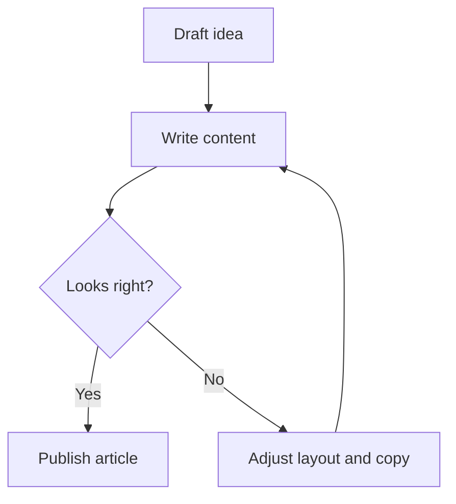

# Typography Sandbox

This page collects common Markdown blocks to validate spacing, rhythm, and readability.

## Paragraphs and links

This is regular body text with an [inline link](/blog), plus some **strong text**, _emphasis_, and `inline code`. Text can also be ~~struck through~~ when something is outdated or corrected.

Good writing does not announce itself. It simply moves the reader from one sentence to the next without friction, without confusion, and without unnecessary detours into territory that does not serve the point being made. Line length, spacing, and contrast are not cosmetic — they are the infrastructure that makes extended reading comfortable. A column that is too wide forces the eye to travel too far. One that is too narrow chops thought into fragments. The right measure keeps the reader inside the text rather than aware of the page.

## Lists

### Unordered list

- One simple bullet item.
- Another item with a longer sentence to test wrapping behavior for multiline bullets.
- A nested list:
  - Nested item A
  - Nested item B

### Ordered list

1. First step.
2. Second step with additional context.
3. Third step.

### Task list

- [x] Write first draft
- [x] Add examples
- [ ] Publish and gather feedback

## Headings

# Heading 1

## Heading 2

### Heading 3

#### Heading 4

##### Heading 5

###### Heading 6

## Quote

> Design is reducing noise until the content can breathe.

## Code blocks

```ts
type PostMeta = {
  title: string;
  date: string;
  description?: string;
};

const byDateDesc = (a: PostMeta, b: PostMeta) => {
  return new Date(b.date).getTime() - new Date(a.date).getTime();
};
```

```bash
npm run dev
npm run build
```

## Mermaid

This Mermaid block is here to validate how diagrams sit inside long-form prose and whether the module styling matches the rest of the typography.



## Table

| Token      | Usage                        | Example               |
| ---------- | ---------------------------- | --------------------- |
| Background | Page canvas color            | `bg-stone-100`        |
| Accent     | Link hover and focus moments | `text-amber-800`      |
| Divider    | Section separation           | `border-stone-300/70` |

## Horizontal rule

---

## Image and component


## Keyboard input

Use <kbd>Cmd</kbd> + <kbd>K</kbd> to open quick navigation.

<InlineBadge text="Markdown + Vue component still works"></InlineBadge>

## Topic badge colors

<TopicPalette></TopicPalette>

## Article header combinations

### Title only

::article-header
---
title: "Article Header: Title only"
---
::

### Date only

::article-header
---
title: "Article Header: Date only"
date: 2026-03-10
---
::

### Icon only

::article-header
---
title: "Article Header: Icon only"
icon: streamline-ultimate-color:app-window-bookmark
---
::

### Topics only

::article-header
---
title: "Article Header: Topics only"
topics:
  - Vue
  - Nuxt Content
  - Tailwind
---
::

### Date + icon

::article-header
---
title: "Article Header: Date and icon"
date: 2026-03-10
icon: streamline-ultimate-color:app-window-bookmark
---
::

### Date + topics

::article-header
---
title: "Article Header: Date and topics"
date: 2026-03-10
topics:
  - Architecture
  - Refactoring
---
::

### Icon + topics

::article-header
---
title: "Article Header: Icon and topics"
icon: streamline-ultimate-color:app-window-bookmark
topics:
  - Design Systems
  - UI Components
---
::

### Full metadata + multiline icon scaling

::article-header
---
title: Article Header with all metadata and a longer title that wraps into multiple lines for icon scaling
date: 2026-03-10
icon: streamline-ultimate-color:app-window-bookmark
topics:
  - Nuxt
  - Vue
  - Content
  - UI
title-lines: 3
---
::

## External link card combinations

### URL only

::external-link-card
---
url: https://example.com/url-only
---
::

### URL + title

::external-link-card
---
url: https://example.com/url-title
title: External resource with title
---
::

### URL + label

::external-link-card
---
url: https://example.com/url-label
label: Recommendation
---
::

### URL + icon

::external-link-card
---
url: https://example.com/url-icon
icon: streamline-ultimate-color:app-window-bookmark
---
::

### URL + title + label

::external-link-card
---
url: https://example.com/url-title-label
title: External resource with title and label
label: Recommendation
---
::

### URL + title + icon

::external-link-card
---
url: https://example.com/url-title-icon
title: External resource with title and icon
icon: streamline-ultimate-color:app-window-bookmark
---
::

### URL + label + icon

::external-link-card
---
url: https://example.com/url-label-icon
label: Recommendation
icon: streamline-ultimate-color:app-window-bookmark
---
::

### URL + title + label + icon

::external-link-card
---
url: https://example.com/url-title-label-icon
title: External resource with full metadata
label: Recommendation
icon: streamline-ultimate-color:app-window-bookmark
---
::
